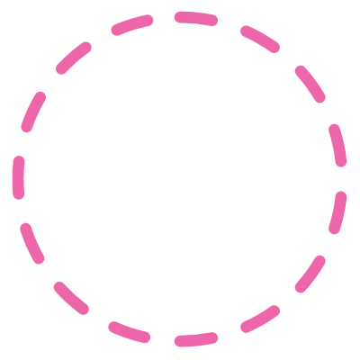
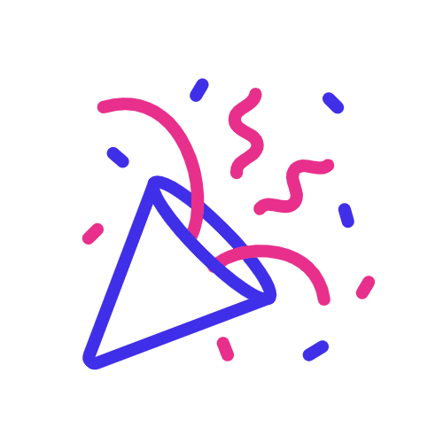
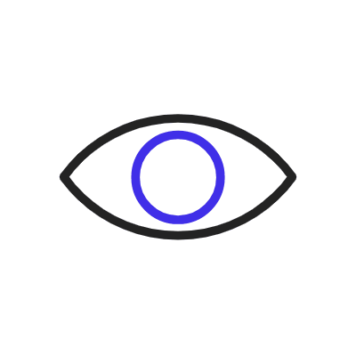

<!-- INTRO SECTION -->
## 
&nbsp;&nbsp;Hello.World&nbsp;{&nbsp;&nbsp;}
  

  
### 
I am here to Learn ,explore🙂 && Contribute with Github🌱
  

  

    
  
 
  
  
  
  
<!-- ABOUT ME SECTION -->  
## 
About Me
   

  <!-- ABOUT INFO -->
  <ul>
    <li>🌈 I’m currently working on my <b>Web development and Problem Solving skills(DSA)</b>.</li>
    <li>🌱 I’m currently pursuing my <b>Btech</b> degree in <b>Computer Science</b>.</li>
    <li>💗 I love to design website <b>UX|UI</b>.</li>
    <li>📄  Currently, I'am exploring my <b>javascript</b> concepts.</li>
    <li>⚡ I believe that <b>Dream it,wish it and do it</b>.</li>
  </ul> 

<!-- TECHNOLOGIES SECTION -->
## 
Technologies 💻&nbsp;🌱(I have worked with)
   

  <!-- TECHNOLOGIES LIST -->
    <ul>
      <li>💻 <b>HTML| CSS | JavaSricpt</b>.</li>
      <li>🔧 <b>C | java | python</b>.</li>
      <li>🔨 <b>Visual Studio | Eclipse |Git</b>.</li>
      <li>📊 <b>Algorithm | Data Structures</b>.</li>
      <li>✂️ <b>Figma | UX/UI</b>.</li>
    </ul> 
  
  
  
  
<!-- STATS SECTION --> 
## 
Stats
   

  

    
  

  
  
  <!-- CONTRIBUTION SECTION -->  
  

    
  

 
  <!-- STREAK SECTION -->
  

    
  

  
  <!-- LANGUAGES USED SECTION -->
  

    
  

 
  
  

<!-- CONNECT ME SECTION -->
## 
&nbsp;&nbsp;Connect with me
  

  

  <!-- LINKEDIN SECTION -->
    &nbsp;&nbsp;
  <!-- EMAIL SECTION -->
     
  

